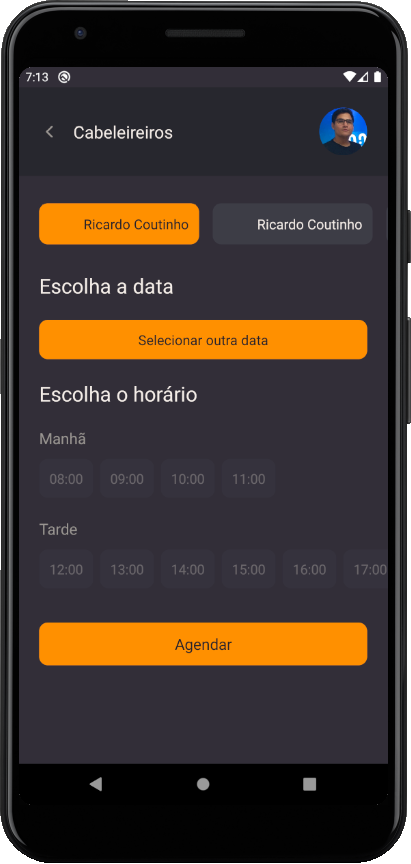
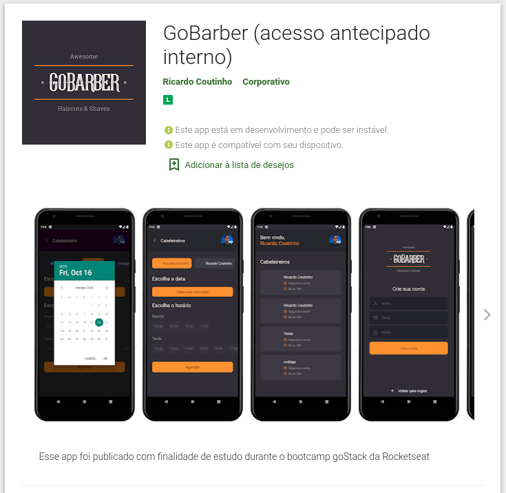

## Prints da aplicação

## Como executar

Primeiramente baixe, configure e execute o [backend](https://github.com/RCout1nho/gobarber-backend)

## Tecnologias

- Microsoft AppCenter para gerenciamento de versões para publicação
- CodePush para hot update

Após esses passos, execute `yarn` para instalar as dependências necessárias e siga as seguintes
instruções de acordo com sua plataforma:

### Android

Para instalar a aplicação em modo debug no emulador ou dispositivo físico via USB, execute `yarn android` e para
executar a aplicação: `yarn start`

### iOS

Para instalar a aplicação em modo debug no seu simulador, primeiramente rode `pod install` e em seguida `yarn ios`. Para
executar a aplicação, execute: `yarn start`
